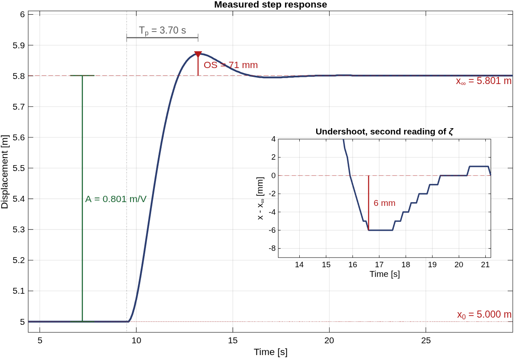
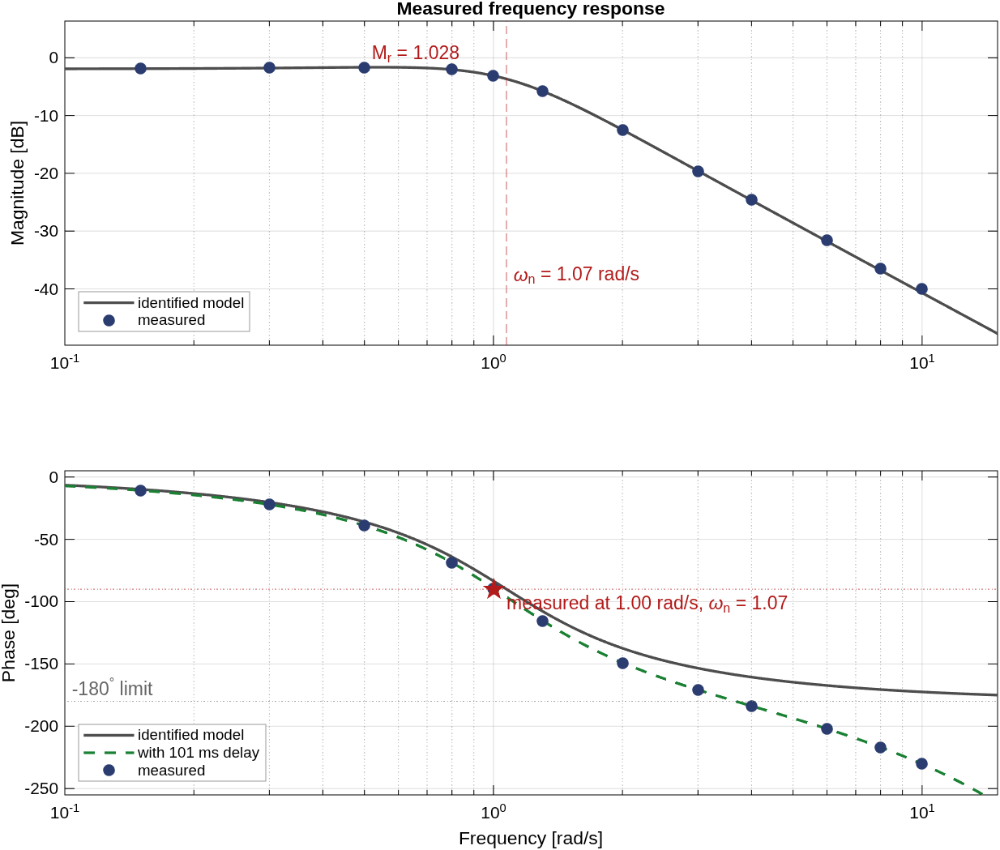
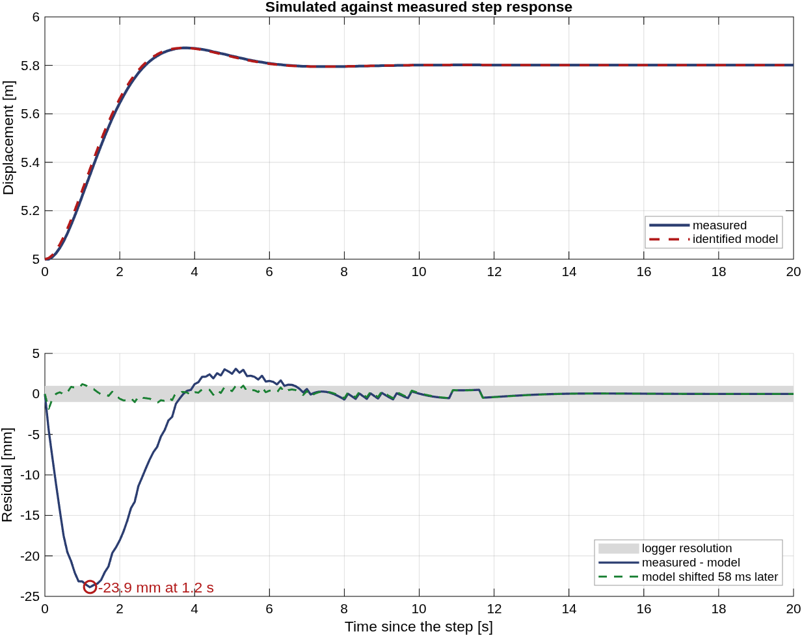
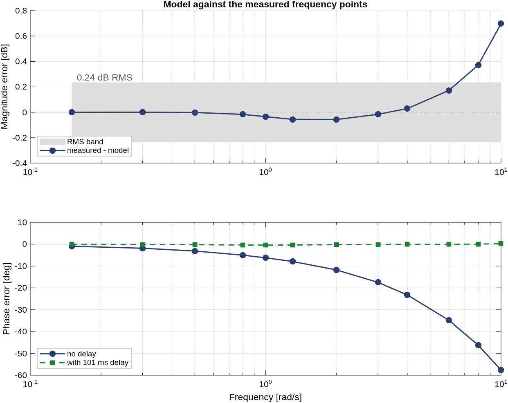
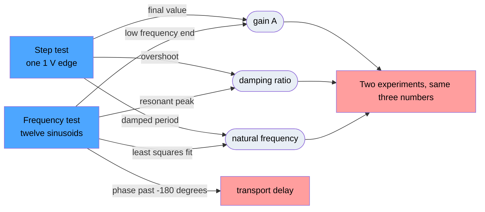
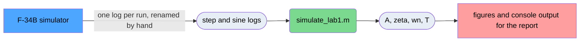

# Suspension system identification

Recovers the transfer function of an unknown spring, mass and damper suspension from two
bench measurements: one step response and a set of single frequency sinusoids. Written for
the F-34B suspension simulator used in EEE3094S Control Systems Engineering at UCT, where
the plant parameters are generated per student and cannot be looked up.

The plant is

$$m\ddot{x} = -b\dot{x} - kx + F, \qquad m = 1 \quad \Longrightarrow \quad G(s) = \frac{1}{s^2 + bs + k}$$

so identifying it means measuring the steady state gain, the damping ratio and the natural
frequency, then converting those to $k$ and $b$.

## What came out

$$G(s) = \frac{0.921\,e^{-0.101s}}{s^2 + 1.310\,s + 1.150}$$

| Quantity | Symbol | Value |
| --- | --- | --- |
| Steady state gain | $A$ | 0.801 m/V |
| Damping ratio | $\zeta$ | 0.611 |
| Natural frequency | $\omega_n$ | 1.072 rad/s |
| Stiffness | $k$ | 1.150 s$^{-2}$ |
| Damping | $b$ | 1.310 s$^{-1}$ |
| Force per volt | $\alpha$ | 0.921 m V$^{-1}$s$^{-2}$ |
| Transport delay | $T$ | 101 ms |

Every parameter is scaled to the mass, so $k$, $b$ and $\alpha$ are per unit mass.

The poles sit at $-0.655 \pm j0.849$, so the suspension is underdamped and settles after a
single overshoot. The delay is one sample period of the logger and shows up only in the
phase, which is what identifies it as a delay rather than a missing pole.



*The step test. A 1 V step gives a 0.801 m rise with 8.9 percent overshoot, peaking 3.70 s
after the step, which is enough to fix all three parameters on its own. The inset is the
undershoot that follows, 6 mm against a 0.9 m axis, and its depth relative to the first peak
gives a second reading of the damping ratio. The staircase in it is the 1 mm logger
resolution.*



*The frequency test, measured points against the model built from the step data alone. The
resonant peak reaches 0.827 m/V at 0.5 rad/s, 1.028 times the low frequency gain. The
measured phase crosses -90 degrees at 1.00 rad/s while the step test puts $\omega_n$ at
1.07, and that gap is the first sign of the delay. Phase then runs past -180 degrees at the
top of the sweep, which no second order system can do. The dashed trace is the same model
with the 101 ms delay added.*



*Validation in time. RMS error is 0.0056 m over the logged response, 0.7 percent of the
rise. What error there is sits in the first four seconds and peaks at -23.9 mm. Shifting the
model 58 ms later takes the RMS residual to 0.32 mm, a third of the logger resolution, which
is the delay showing up again in the time domain.*



*Validation in frequency. Magnitude stays inside the 0.24 dB RMS band, shaded, until 6 rad/s
and then lifts, at the points where the output has fallen to a few resolution steps. The
phase residual does not scatter. It grows steadily to -58 degrees at 10 rad/s and follows
$-\omega T$ across two decades. Adding the delay leaves the squares, 0.2 degrees RMS.*

## What the analysis does

From the step log it reads the gain off the final value, the damping ratio off the first
overshoot with the logarithmic decrement as a cross-check, and the damped period off the
mean spacing of every peak in the record. Only peaks clearing the final value by several
times the logger resolution count, since a sample one step above the settled value is
quantisation noise and counting it wrecks the averaged period.

It also fits the two real pole form, a constant plus two decaying exponentials, to the same
record. That fit cannot produce an overshoot at all, which is the numerical version of
reading the pole type off the shape of the curve rather than judging it by eye.

From the sine logs it reads the same quantities a second time and independently: the gain
from the low frequency end, the damping ratio from the height of the resonant peak, and the
natural frequency from a least squares fit to all twelve points. Amplitude and phase at each
drive frequency come from a least squares fit against a sinusoid at the known frequency,
which works on records far too coarsely sampled for peak picking.

A second order model cannot lag past -180 degrees. Where the measured phase runs past it,
the excess is fitted as a transport delay, which grows without bound and leaves the
magnitude alone, rather than as a third pole, which would bend both.

Two experiments giving the same three numbers is what makes the answer worth anything. The
one place they disagree is the phase, and that disagreement is the result:



Blue is the bench, grey is a parameter measured twice and red is a result, with the method
on each arrow. Only the frequency test can produce the bottom right box, because a single
step edge carries no evidence of a delay that a slightly slower rise would not explain
equally well.

It then validates the model in both domains, as RMS error against the step record and as
RMS magnitude and phase error against the measured frequency points, and prints the spread
across repeat step runs so the uncertainty of the method can be told apart from the error
of the model. Runs at a second input amplitude check that the plant is linear at all.

All of that is `simulate_lab1.m`, which draws every figure in the report. The arithmetic
was checked once against a second implementation written from the same equations without
sharing any code, which agreed to four decimal places on every parameter. That one was in
Python and has been removed. Two things it established are worth recording, since the code
that showed them is gone: the two implementations could disagree about a bug but not about
the plant, and fitting the delay to synthetic data from a plant with no delay returns 0 ms,
so a delay fitted to real logs is in the measurements rather than invented by the fit.



Same palette one level up, with green added for code in this repo: where the files go
rather than where the numbers come from.

## Running it

Needs MATLAB with the Control System Toolbox, for `tf` and `step`.

```sh
matlab -batch simulate_lab1
```

No arguments. The log folder is set by the `datadir` line at the top of the script, which is
resolved relative to the file, so it runs from anywhere. The logs themselves are not in this
repo. Point that line at your own session folder.

Sine logs are named for the frequency they were driven at, with `p` standing in for the
decimal point, so `sine_1p3.csv` is 1.3 rad/s, and the frequency is read out of the file
name. A name carrying a tag after the frequency, like `sine_1p0_a3.csv`, is that frequency
driven at another amplitude. It is held out of the sweep and used for the linearity check
instead. Figures come from the first step log, and the rest give the repeatability spread.

The run prints every measured value the report quotes and writes four figures into
`report/figures/`. `report/matlab_output.txt` is that console output saved, which the report
appendix lists so the numbers can be traced back to a run rather than taken on trust.
`sim_bench.png` in the figures folder is not generated. It is a crop of a simulator
screenshot showing the settings the runs were made with, and the report uses it in the
methodology.

## Report

`report/` holds the LaTeX source of the lab report, with the figures and saved console
output it consumes committed alongside it. Build with `pdflatex main.tex` twice, from
inside `report/`.

## Bench notes

Two things are easy to get wrong on the day and expensive to discover afterwards. The
simulator appends every run to one fixed CSV file name, so each run has to be copied,
renamed and cleared before the next is started, or several runs stack up in one file that
still looks valid. And the sine frequencies have to reach far enough above the corner for the
magnitude to settle onto its asymptote. The script prints the model's local slope at
multiples of $\omega_n$ for exactly this reason: it is $-20$ dB per decade at $\omega_n$,
still only $-36.5$ at $1.5\omega_n$, and does not reach $-40$ until $2\omega_n$. A sweep
that stops near the corner reads far too shallow and looks as though a second order model
had failed.
